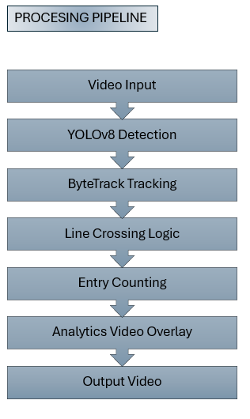
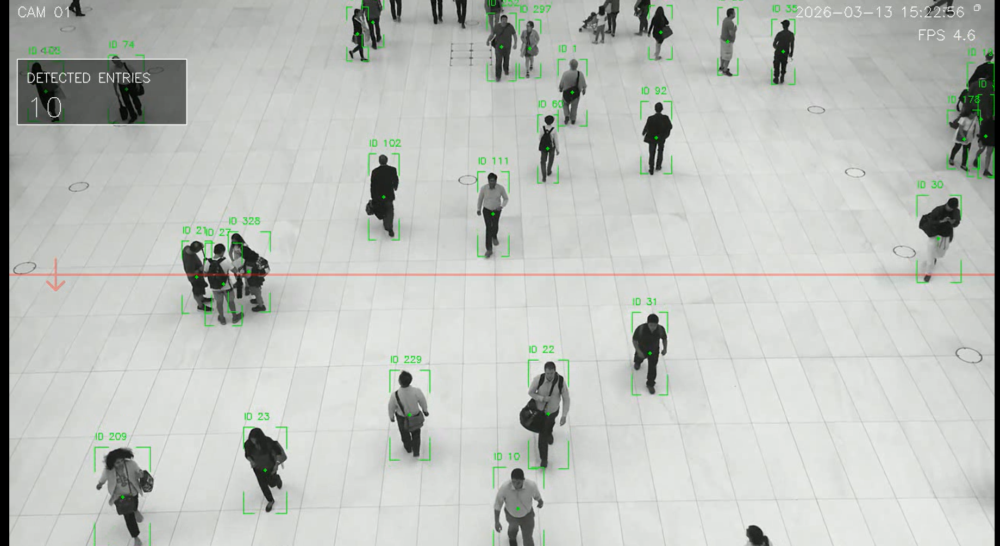

# YOLOv8 Line Crossing People Counter

A simple computer vision project that detects, tracks and counts people crossing a virtual line in a video stream.
The system uses YOLOv8 for object detection, ByteTrack for tracking and a custom line-crossing logic to count entries.

## Process Pipeline

## 🎬 Demo

  

## 

## 🚀 Features

- Person detection using YOLOv8
- Multi-object tracking with ByteTrack
- Line crossing detection
- Entry counting
- CCTV-style video overlay
- Corner bounding boxes
- Transparent counting line
- Camera header (camera ID, timestamp, FPS)

## Pipeline

The processing pipeline works as follows:

Video input
↓
YOLOv8 person detection
↓
ByteTrack object tracking
↓
Line crossing logic
↓
Entry counting
↓
Video analytics overlay
↓
Output video

## Example Output

Example frame from the processed video:

The overlay includes:

- object ID
- bounding box
- counting line
- entry counter
- camera information

## Project Structure

yolov8-line-crossing-counter
│
├─ video
│   └─ input.mp4
│
├─ screenshots
│   ├─ example.png
│   └─ pipeline.png
│
├─ process_and_count.py
│
├─ requirements.txt
│
├─ README.md
│
└─ .gitignore

## Installation

Clone the repository:

git clone https://github.com/yourusername/yolov8-line-crossing-counter.git
cd yolov8-line-crossing-counter

pip install -r requirements.txt

## ▶️ Usage

Place your input video inside the video folder and run the script:

python process_and_count.py

The processed video with analytics overlay will be saved to:

output/counting_video.mp4

The YOLO model will be automatically downloaded by Ultralytics on first run.

## Technologies Used

    * YOLOv8 (Ultralytics)
    * OpenCV
    * PyTorch
    * ByteTrack

## Possible Extensions

This project can be extended with:

    * real-time camera processing

    * entry/exit counting

    * REST API for analytics

    * dashboard visualization

    * deployment on edge devices (Raspberry Pi)

## License

This project is released under the MIT License.